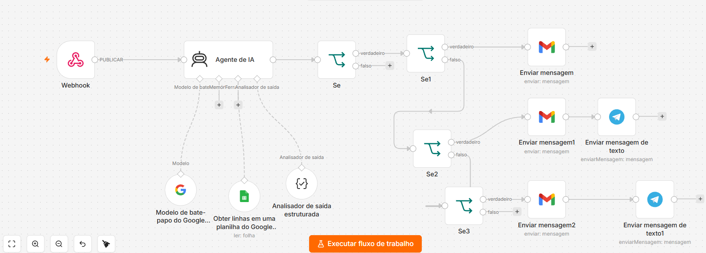
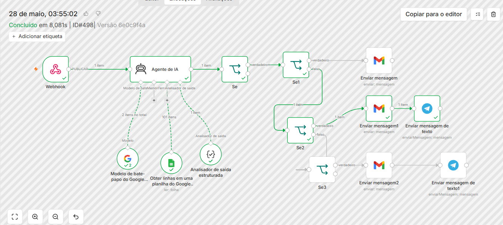
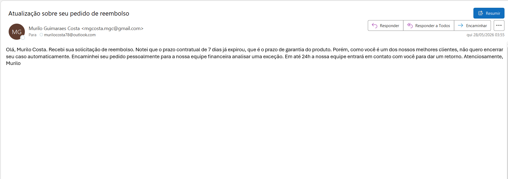

# AI Refund Analysis Agent with n8n

Sistema inteligente de análise de pedidos de reembolso utilizando IA, n8n, Google Gemini, Gmail, Telegram e Google Sheets.

---

## Visão Geral

Este projeto automatiza o processo de análise de solicitações de reembolso, avaliando regras de negócio, perfil do cliente e contexto da solicitação com apoio de inteligência artificial.

O fluxo inclui:
- Recebimento de pedidos via Webhook
- Análise automática com IA
- Consulta de dados em Google Sheets
- Classificação de clientes comuns, VIPs e insatisfeitos
- Validação de prazo de garantia
- Envio automático de e-mails ao cliente
- Notificação interna via Telegram

---

## Solicitação recebida no Telegram


---

## Workflow completo no n8n



---

## Execução do fluxo



---

## E-mail enviado ao cliente



---

## Tecnologias Utilizadas

- n8n
- Google Gemini AI
- Gmail
- Telegram
- Google Sheets
- Webhook
- Structured Output Parser
- Condições IF

---

## Fluxo da Automação

1. Cliente envia solicitação de reembolso
2. Webhook recebe os dados do formulário
3. Agente de IA analisa a solicitação
4. Sistema consulta dados do cliente em Google Sheets
5. IA estrutura a saída em JSON
6. Fluxo avalia se o prazo de reembolso expirou
7. Sistema identifica o perfil do cliente
8. Caso seja cliente comum:
   - envia e-mail informando negativa do reembolso
9. Caso seja cliente VIP:
   - envia e-mail ao cliente
   - notifica equipe no Telegram para avaliação manual
10. Caso seja cliente insatisfeito:
   - escala o caso para tratativa especial
   - notifica equipe interna

---

## Funcionalidades

### Análise Inteligente
- Interpretação automática da solicitação
- Identificação do sentimento do cliente
- Classificação do perfil de atendimento

### Regras de Negócio
- Validação de prazo de garantia
- Tratamento diferenciado para clientes VIPs
- Escalonamento para clientes insatisfeitos

### Comunicação Automatizada
- Envio de e-mails personalizados
- Notificações internas no Telegram
- Mensagens adaptadas ao cenário do cliente

### Governança Operacional
- Padronização de decisões
- Redução de análise manual
- Encaminhamento inteligente para equipe responsável

---

## Estrutura do Projeto

```text
README.md
/imagens
   mensagem-telegram.jpeg
   fluxo-completo.png
   fluxo-sucesso.png
   email-reembolso.png
```

## Melhorias Futuras

- Dashboard de solicitações
- Histórico de reembolsos por cliente
- Integração com CRM
- Registro automático em planilha
- Aprovação humana antes do envio
- SLA automático
- Banco vetorial
- Multiagentes IA

  ## Autor

# Murilo Guimarães Costa

Especialista em Projetos, Automação e IA Aplicada.

### Áreas de atuação
- Open Finance
- Gestão de Projetos
- Inteligência Artificial
- n8n Automation
- Integrações

### GitHub
https://github.com/Murilo58


